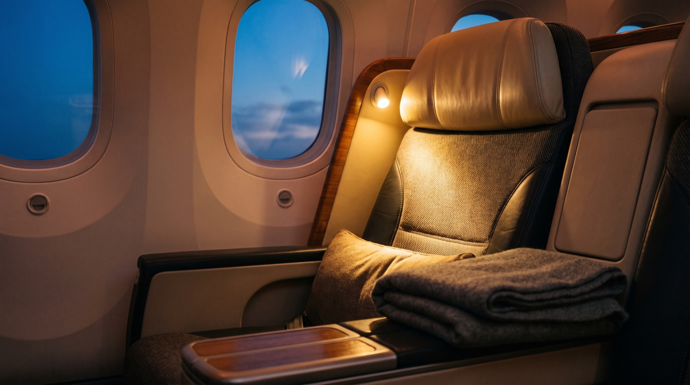
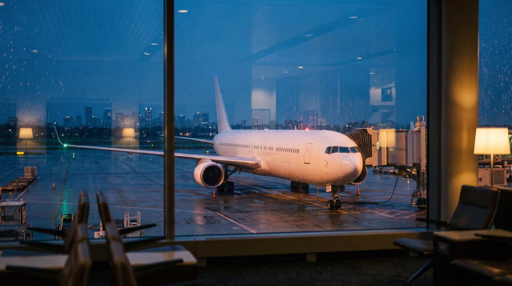

SLUG: citi-thankyou-japan-airlines-transfer-partner
CATEGORY: deals
TITLE: Citi Just Added JAL: What the 30% Bonus Is Worth
EXCERPT: Citi ThankYou points now transfer to Japan Airlines, with a 30% bonus through October 24. The cheaper-looking path to a JAL business seat can cost you $350 more in cash.
META_TITLE: Citi Adds JAL: What the 30% Bonus Is Worth
META_DESCRIPTION: Citi ThankYou points now transfer to Japan Airlines with a 30% bonus. What the miles buy, what the surcharges cost, and when to use American instead.
COVER_ALT: Split cover: a phone on a desk labeled Citi ThankYou points, beside a business class seat labeled JAL Mileage Bank
---BODY---
**Citi ThankYou points now transfer to Japan Airlines Mileage Bank at 1:1 on the annual-fee Strata cards, with a 30% bonus through October 24, 2026.** The bonus is real, and on paper it puts a lie-flat seat to Tokyo within reach of about 43,000 points. The part the coverage skips: JAL charges its own carrier surcharges, so that same seat carries roughly $350 in cash per person, each way.

## Key takeaways

- Citi's 30% bonus to Japan Airlines is worth having, but it changes the points side of the deal only; it does nothing about the cash side.
- A JAL business award booked with JAL's own miles ran about $320 to $360 per person each way in surcharges and taxes at the time of writing, and that reduced rate is filed only through October 31, 2026.
- Citi also transfers to American AAdvantage at 1:1, and American does not pass JAL's surcharges on, so the same seat costs more miles and almost no cash.
- JAL's best value is on its partner chart, which prices by total distance, so a round trip can cost less than two one-ways. On JAL's own flights, a round trip is simply double.

Citi added Japan Airlines Mileage Bank as a transfer partner on September 20, 2026, and launched it with a 30% bonus that runs through October 24. Citi says Tokyo is the destination its travel customers book most often internationally, so the partnership makes obvious sense for the bank.

For a points holder the useful question is not whether this is good news, but which of Citi's two doors to the same JAL cabin you should walk through, because they are priced very differently.

## What Citi actually added

The mechanics are simple, and they depend on which Citi card you hold.

- **Annual-fee cards** (Citi Strata Elite and Strata Premier, plus legacy Prestige and AT&T Access More) transfer at **1:1**. With the bonus, 1,000 points become 1,300 JAL miles.
- **No-annual-fee cards** (Citi Strata, Double Cash, Custom Cash, ThankYou Preferred) transfer at **1:0.7**. The bonus applies here too, at roughly 1:0.91, which most of the coverage does not mention. You still lose value on every point, just less of it during the promotion.

Transfers move in 1,000-point increments, and the name on your Citi account has to match your JAL Mileage Bank profile. Reports on speed vary from near-instant to a few business days, so treat "instant" as a hope rather than a plan. If you are new to how any of this works, start with our [guide to flying on credit card points](/blog/how-to-fly-for-free-with-credit-card-points), then our [guide to transfer partners](/blog/transfer-partners-explained-guide), which covers the mechanics and the one rule that matters most.

## The 30% bonus, and the date that matters

The bonus runs from September 20 through **October 24, 2026**. Citi has not published a cutoff time or a time zone, and Upgraded Points says it asked and could not get one, so if you intend to use it, do not leave it to the last evening.

At the time of writing, JAL's own award chart for members in the Americas prices a one-way between North America and Japan at 27,000 miles in economy, 40,000 in premium economy and 55,000 in business. With the 30% bonus, that 55,000-mile business seat costs about 43,000 Citi points from an annual-fee card. From a no-fee card the same seat needs roughly 61,000 points, which is the number that card's holders should be running.

One caveat that matters more than the arithmetic: 55,000 is the **base** tier, and base-level seats are limited. When those are gone, JAL sells the same cabin through its Award Ticket PLUS tier, where the price climbs as seats get scarce. JAL publishes only a maximum, and that maximum sits far above the base: in the airline's own worked example, a Honolulu economy award runs from 20,000 base miles up to 107,000. Assume PLUS can be a multiple of the base price, not a small premium. The advertised price and the available price are often different numbers, which is the same problem we describe in [phantom award space](/blog/phantom-award-space-why-seats-vanish).

## The surcharge nobody put a number on

Most of the coverage calls JAL's taxes and fees "steep" and moves on. Here is the number.

JAL passes its own carrier-imposed surcharges through on awards flown on JAL metal. At the time of writing, a business award between the US and Japan carried roughly **$320 to $360 per person, each way**. A [NerdWallet writer who actually booked one](https://www.nerdwallet.com/travel/news/citi-thankyou-japan-airlines) in September paid about $360. That is not a tax you can route around; it is the airline's own revenue, collected in cash on top of your miles, exactly as described in our guide to [carrier-imposed surcharges](/blog/avoid-fuel-surcharges-award-flights).

Two things make this worse than it looks. First, the figure above is already a **discounted** one: Japanese carriers filed reduced surcharges for tickets issued between September 1 and October 31, 2026, under a temporary government measure. That filing expires a week after the Citi bonus does, and nobody knows yet what replaces it.

Second, older articles still quote figures as low as $142, which was an economy number to begin with and predates the 2026 surcharge increases. Do not plan around it.

## The same JAL seat, two doors

This is the comparison the launch coverage does not make, and it is the whole decision.

Citi transfers to **American AAdvantage** at 1:1 on the same Strata cards. American is a JAL partner, and American does not pass JAL's carrier surcharges through. So the same JAL business seat, on the same aircraft, on the same day, can be bought two ways:

- **Through JAL Mileage Bank:** about 43,000 Citi points with the bonus, plus roughly $350 in cash.
- **Through American AAdvantage:** about 60,000 Citi points, plus taxes of a few dollars, but only when JAL operates every segment. Add an American or Alaska connection to the same ticket and AAdvantage reprices it at 80,000, so book a positioning flight separately.

The JAL door saves you about 17,000 points and costs you about $345 more. Put the other way round, you are buying those 17,000 points back for $345, which works out to roughly two cents a point. That is at or above the range ThankYou points are commonly valued at, so for most people the American door is the better buy, even though it looks more expensive on the points line.

There is one clear exception, and it is the reason to keep JAL miles in mind at all: **availability**. JAL opens its own award space around 360 days before departure, roughly a month before partner programs like American can see it. If JAL has the seat your family needs and American does not, paying the surcharge is a perfectly rational trade. Paying it when American has the same seat is not. Our walkthrough of [booking business class to Tokyo](/blog/business-class-to-tokyo-with-points) maps the rest of the route's options, including ANA.

## Where JAL miles genuinely win

The partnership is more interesting away from the Tokyo nonstop, because JAL prices partner awards on a separate, distance-based chart that adds up the whole itinerary.

That structure has a useful consequence: a round trip is often cheaper than two one-ways, since the distance bands are cumulative. On JAL's own flights the opposite is true, where a round trip is simply double the one-way price. Conflating the two is an easy way to overpay.

The standout is Air France business class from the US, which guides price in the region of 42,000 to 60,000 JAL miles depending on distance, with fees of only a few dollars. That is not because Air France has no surcharges. It has them, and essentially every other program passes them on. JAL is the outlier that does not collect them, which is what makes this worth knowing. Booking that same Air France seat through Flying Blue itself typically costs more miles and several hundred dollars more in cash. British Airways awards are bookable too, but they carry roughly $200 to $280 in surcharges from the US, so they are far less compelling than the mileage price suggests.

JAL also allows generous stopovers on partner awards, which is unusual and genuinely valuable if you want two cities for one redemption.

## Before you move a single point

JAL's program has rules that catch people out, and a transfer is irreversible.

- **The 60-day rule.** JAL restricts redemptions for 60 days after you open a Mileage Bank account, not 60 days after your miles arrive. Bilt and Capital One members have a seven-day wait instead; whether Citi has the same carve-out was still unconfirmed at the time of writing. If you are opening a new JMB account to use this bonus, ask before you transfer.
- **Miles expire 36 months after they land**, at the end of that month, with no extension and no reinstatement for most members.
- **Awards are for you and close family only**, broadly a spouse and relatives within the second degree. You cannot book a friend, and JAL can ask for proof when surnames differ.
- **Ticketed JAL awards cannot be changed**, only cancelled and rebooked for a fee.

All of which is the long way of saying the same thing we say about every transfer: find and confirm the seat first, then move the points. Never the reverse.

## What this is worth after October 24

When the bonus ends, the business seat that cost about 43,000 Citi points costs the full 55,000, plus the same cash surcharge. Against 60,000 points and almost no cash through American, the JAL door gets harder to justify on price alone, and its case narrows to the one it always really had: seats American cannot see yet, or cannot see at all.

That is not a reason to ignore the partnership, just to be honest about what it is: a useful new door, occasionally the only open one, and rarely the cheapest.

## Where a specialist comes in

Pricing this properly means holding several moving parts at once: which of your cards transfers at which ratio, whether the base tier or PLUS is what is actually available on your dates, what the surcharge is on the day you book, and whether American can see the same seat for a few dollars in tax.

That is the work we do by hand. A Saver Miles specialist checks both doors for your exact dates, tells you which one to use and what it will really cost in points and cash, and says so plainly when the answer is "book it with American instead". See [how it works](/how-it-works).

## Frequently asked questions

### Is the Citi transfer bonus to Japan Airlines worth it?

It is worth it when you have a specific JAL seat confirmed and JAL's own program is the way to get it, typically because American cannot see that seat. It is not worth transferring speculatively: JAL miles expire 36 months after they land, the transfer cannot be reversed, and on the flagship Tokyo business award the cash surcharge usually outweighs the miles you save.

### Do JAL award tickets have fuel surcharges?

Yes, on flights operated by JAL. At the time of writing a US to Japan business award carried roughly $320 to $360 per person each way, and that was a temporarily reduced rate filed only through October 31, 2026. Partner awards are different: the surcharge follows the operating airline, so Air France comes in at a few dollars while British Airways runs into the hundreds.

### How long do Citi to JAL transfers take?

Reports range from near-instant to a few business days, and at least one guide cites a worst case of up to 14 days. Because award space can disappear while a transfer is in flight, treat the speed as unpredictable: confirm the seat is bookable first, transfer only what that booking needs, and book as soon as the miles land.

### Can I book a JAL award ticket for a friend?

No. JAL restricts award redemptions to the member and close family, broadly a spouse, including a same-sex partner, and relatives within the second degree of kinship, and it can ask for documentation when surnames differ. If you are booking for anyone outside that circle, this is the wrong program and you should price the trip through a partner instead.

## Start with a free points audit

If you are holding Citi points and thinking about Japan, the decision is worth ten minutes of a specialist's time before the transfer, not after. [Start with a free points audit](/individual): tell us your dates and what you hold, and we will tell you which door is cheaper, in points and in cash, before anything moves.
